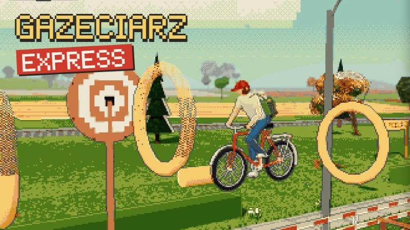

# Gazeciarz Express

Gazeciarz w jedną stronę (pixel art, three.js). Ulice mają koniec: startujesz spod domu na Kasztanowej, roznosisz gazety przez mniej więcej półtorej minuty, na końcu ulicy czeka tor z przeszkodami w klimacie mapy, potem gazeta z wynikiem i od razu kolejna mapa: Wieś, Park, Deptak, Zima.



Jedyna wersja Gazeciarza. Wersja z pętlami (poziom = pełne okrążenie) jest w archiwum `.archive/gazeciarz-petle` od 04.10.2026. Zapis `gzx.save`, port 8810.

### Wersja 4: tydzień i rosnąca trudność

- trudność rośnie od Kasztanowej do Zimy: limit czasu 150 → 135 s, cel gazet 9 → 14, auta 1 → 3, a tor z przeszkodami coraz trudniejszy (na Zimie najdłuższy slalom, duży skok, obręcze)
- tydzień pracy = pięć map: Kasztanowa poniedziałek, Wieś wtorek, Park środa, Deptak czwartek, Zima piątek; w piątek premia za cały tydzień
- pasek **zadowolenia czytelników** pod paskiem życia: rośnie za gazetę dla abonenta, spada za pominiętego abonenta, zły tytuł, wybitą szybę abonenta i skrzynkę przejętą przez kuriera; przechodzi z dnia na dzień
- w gazecie po każdym dniu: zadowolenie i wynik tygodnia
- plan kolejnych etapów (dynamika, tor ze znakiem firmowym mapy, boss: kurier w żółtej furgonetce, finał z powrotem do domu): `docs/plan-express.md`

### Wersja 3: uczciwy finał

- wywrotka na torze z przeszkodami nie zabiera życia (kosztuje czas i punkty), więc tor nie kończy przejazdu tuż przed metą
- tor przygotowuje się na starcie mapy (grafika gotowa wcześniej), mniejsze szarpnięcie, gdy pojawia się w połowie trasy
- zabezpieczenie mety: gdyby gazeta z wynikiem się nie złożyła, gra mimo to jedzie dalej (kolejna mapa albo dom)
- abonenci tylko na ulicy: domy za metą i za startem nie liczą się do tygodnia pracy (wcześniej zawsze „pominięci” i rezygnowali)

### Wersja 2: tor bez rowerzystów

- rowerzyści z naprzeciwka nie wjeżdżają już na tor z przeszkodami (jechali gęsiego przez barierki i pachołki); znikają 60 m przed torem, poza zasięgiem wzroku

### Wersja 1: ulice z końcem

- meta po 810 m (zawsze co najmniej 200 m przed startem pętli, więc baneru START przy mecie nie widać), reszta drogi biegnie dalej
- tor z przeszkodami 270 m na końcu każdej mapy, w jej klimacie: Kasztanowa pachołki, Wieś bele i stodoła, Park donice z kwiatami i staw, Deptak leżaki i piaskownica, Zima bałwany i przerębel
- dom gazeciarza (tabliczka DOM) tylko na pierwszej mapie
- w gazecie po mecie przycisk NASTĘPNA MAPA (klawisz N), bez kartkowania wszystkich stron
- cele (czas, gazety) przeliczone pod krótszą ulicę

Uruchomienie: `python serve.py 8810`, potem http://localhost:8810.

---

Historia wspólna z Gazeciarzem (do jego wersji 190):

## Uruchomienie

```
python serve.py        # http://localhost:8806
```

## Poziomy

1. Ulica Kasztanowa, 2. Wieś, 3. Park, 4. Deptak nad morzem, 5. Zima. Każdy przejazd to dzień tygodnia pracy (abonenci rezygnują po dwóch dniach bez gazety, dzień bez pudła odzyskuje jednego). Medal z gwiazdek, rekord punktów. Szczegóły i historia zmian: `docs/klasyk.md`.

## Sterowanie

Klawiatura: strzałki/WASD jazda, mysz lub przyciski rzutu, Spacja skok (w powietrzu trik), V kopnięcie, R restart poziomu. Telefon i tablet: lewy kciuk skręt i gaz, po prawej RZUT, SKOK/TRIK, KOP, SZYBCIEJ, TYTUŁ.

## Wersje

### Wersja 184: osobna gra

- Klasyk wydzielony z Porannej Trasy do własnego folderu, z własnym zapisem postępu (`gz.save`; za pierwszym razem przejmuje wyniki poziomów Klasyka ze starego zapisu, jeśli gra działa pod tym samym adresem).
- Ekran startowy bez przełącznika wersji: tytuł GAZECIARZ, podtytuł NA CZAS I NA PUNKTY.

### Wersja 185: lżejsza gra

- jedna klatka na Kasztanowej: z 6140 do około 3450 wywołań rysowania i z 3,75 do 2,2 mln trójkątów; do pobrania około 21 MB zamiast 30 MB
- tylko potrzebne modele ludzi; dalecy ludzie i rowery nie są rysowane, cienie rzucają tylko bliscy i duże rzeczy; nieruchome części ulicy i auta scalone po materiale; bez rowerów w ogródkach

### Wersja 186: prawdziwe postacie z ruchem

- dzieci przy skoczniach, wycieczka na rowerkach i babcia z laską to teraz prawdziwe modele ludzi z ruchami (Mixamo przeniesione na postacie MakeHuman), zamiast klocków
- postacie płynnie zmieniają ruchy: kibicowanie, machanie, potknięcie po zderzeniu, bieg goniących, niesienie kubła, klaskanie emerytów
- naprawione: przy ukrywaniu dalekich postaci wracały klocki; złodziej torebek znów się pojawia

### Wersja 187: ławki i kubły

- prawdziwa ławka parkowa (żeliwne boki, listwy) i kubeł na kółkach zamiast klocków
- emeryci siedzą na ławkach przodem do drogi

### Wersja 188: prawdziwe zwierzęta

- pies na smyczy to shiba, krowy w stadzie na Wsi i na pastwisku to prawdziwe animowane modele (paczka zwierząt Quaternius, CC0)
- krowy z pastwiska nie stoją już w ścianach domów

### Wersja 190: skok na cofające auto

- na dach auta cofającego z podjazdu można wskoczyć, ale trzeba trafić w tempo: przy zwykłej jeździe skok mniej więcej 3–4 m przed autem; za wcześnie albo za późno to wywrotka z podpowiedzią, co poszło nie tak
- lądowanie w szczycie skoku: dodatkowe W PUNKT! +2
- naprawione: jazda po dachu cofającego auta od razu kończyła się wywrotką; przez auto stojące na skraju drogi dało się przejechać na wylot

### Wersja 189: psy, stado i kolizje

- psy przy domach to prawdziwe animowane modele (husky i shiba, przebarwione na 6 ras)
- stado przechodzi tylko w dwóch stałych miejscach na Wsi: brama w płocie pastwiska, znak UWAGA KROWY 35 m wcześniej; krowy idą luźno, każda swoim tempem, nie w rzędzie, i omijają przeszkody
- kopnięta krowa: reszta stada rzuca się galopem na drugą stronę; krowa z gazetą też coś powie
- auta i autobus stają przed krowami na jezdni
- przechodnie, rolkarze (skaczą przez skocznie), wycieczka szkolna i biegacze omijają skocznie, ławki i kubły; auta cofające z podjazdu tylko tam, gdzie mają wolną drogę
- kałuże i błoto mniejsze, o nieregularnym brzegu; żadnego auta tuż przy starcie
